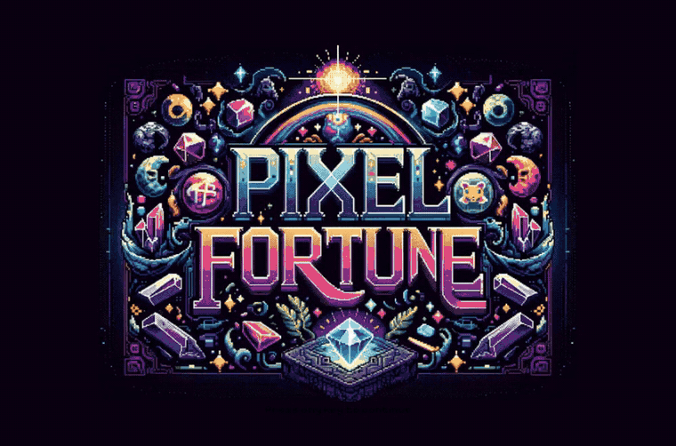

# Pixel Fortune

A pixel-art tarot reader. Draw five cards, turn them over one at a time, and a
fortune teller reads them back to you through an RPG dialog box.

**[Play it → pixel-fortune.vercel.app](https://pixel-fortune.vercel.app)**



## How to play

Press any key (or tap) to enter, press again to draw a hand, then turn each of
the five cards. Once all five are up, the reading pages through the dialog box a
paragraph at a time. The last page returns you to the title.

The whole arc works from the keyboard alone, and works with
`prefers-reduced-motion` set.

## The art

Every card, background and dialog frame is DALL·E-generated pixel art — a full
78-card deck plus the title, table and dialog plates. Nothing here is stock or
licensed third-party art; the raw render passes, rejects included, are in
`asset-work/`.

## Decisions worth looking at

This is the part that makes it a case study rather than a toy. The full decision
log is [issue #7](https://github.com/wmbryce/pixel-fortune/issues/7); these five
are the ones worth the click.

- **Readings are live AI until a hard spend cap, then cached.** A monthly budget
  is reserved atomically _before_ each OpenAI call, so a concurrent burst cannot
  walk past it. Past the cap, visitors get a real reading from a self-populating
  pool of previous ones — and in that mode the reading is chosen first and the
  cards are dealt to match it. The reverse (deal a spread, look up a reading for
  it) misses essentially every time: five of 78 cards never repeats.
  `src/server/budget.ts`, `src/server/cache.ts`, live numbers at
  [`/api/status`](https://pixel-fortune.vercel.app/api/status).
- **The reveal is a critically damped 3D flip whose lift is derived, not
  scheduled.** The card turns on `rotateY` with both faces mounted, and the
  scale/z lift is computed _from_ the rotation value — so an interrupted flip
  can't strand a card off the table — clamped to [0,180] because past the
  landing the sine inverts and the card visibly sinks. No bounce: a tap carries
  no momentum for an overshoot to express. `src/app/_components/Card.tsx`.
- **The spread measures its stage instead of picking a breakpoint.** Both
  candidate layouts (five across, 2+3) are built and the one yielding the larger
  card without overflow wins. The binding constraint is vertical, not
  horizontal: flipping a card barely widens it but makes it 19% taller, above a
  dialog box with a fixed height. A media query cannot express that.
  `src/app/_components/CardTable.tsx`.
- **Reduced motion is a cross-fade, not an off switch.** The card stops turning
  but its back still fades off the front; the deal keeps its beat while each
  card fades up in the seat it keeps; a press dims instead of lifting. A visitor
  with the preference set can always tell their input registered.
  `src/app/_libs/motion.ts`.
- **"Press any key" had to learn which keys aren't presses.** Tab is how you
  reach the cards, so answering it advanced the flow out from under the visitor;
  arrows, Page/Home/End and Space scroll a spread taller than the stage. Each is
  dropped where its purpose in that focus context is navigation, and every other
  key still counts. `src/app/_libs/keys.ts`.

## Running it locally

```bash
npm install
cp .env.example .env.local   # add an OPENAI_API_KEY
npm run dev
```

Everything else is optional: without Redis credentials the spend cap, rate
limiter and reading cache fall back to per-instance memory, which is fine for
development. To exercise the fortune path with no OpenAI key at all, use the
stub endpoint in `test/mock-openai.mjs` (see `AGENTS.md`).

## Stack

Next.js 16 (App Router) · React 19 · tRPC 11 · `motion` 12 · Tailwind 3 ·
TypeScript · Vitest. Deployed on Vercel with Upstash Redis for durable budget,
cache and rate-limit state.

`npm test` (195 tests), `npm run typecheck`, `npm run lint`. CI runs all three
plus the build on every push. Architecture and sharp edges are in `AGENTS.md`.
